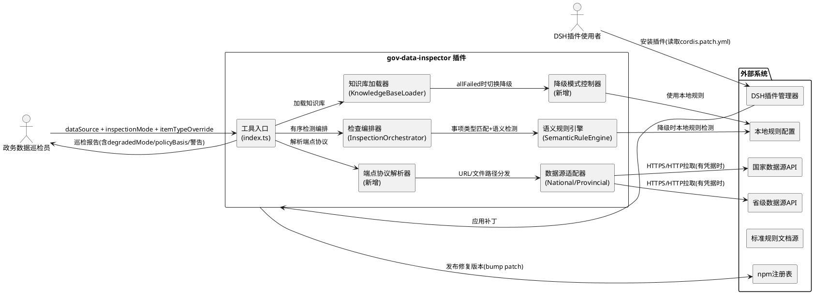
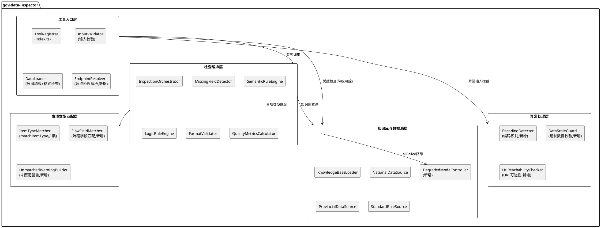
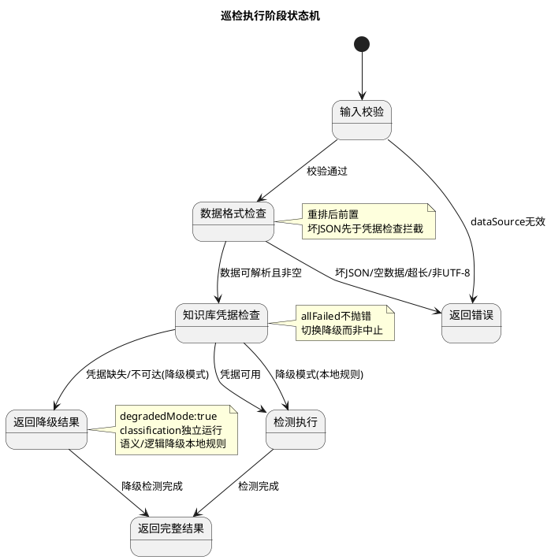
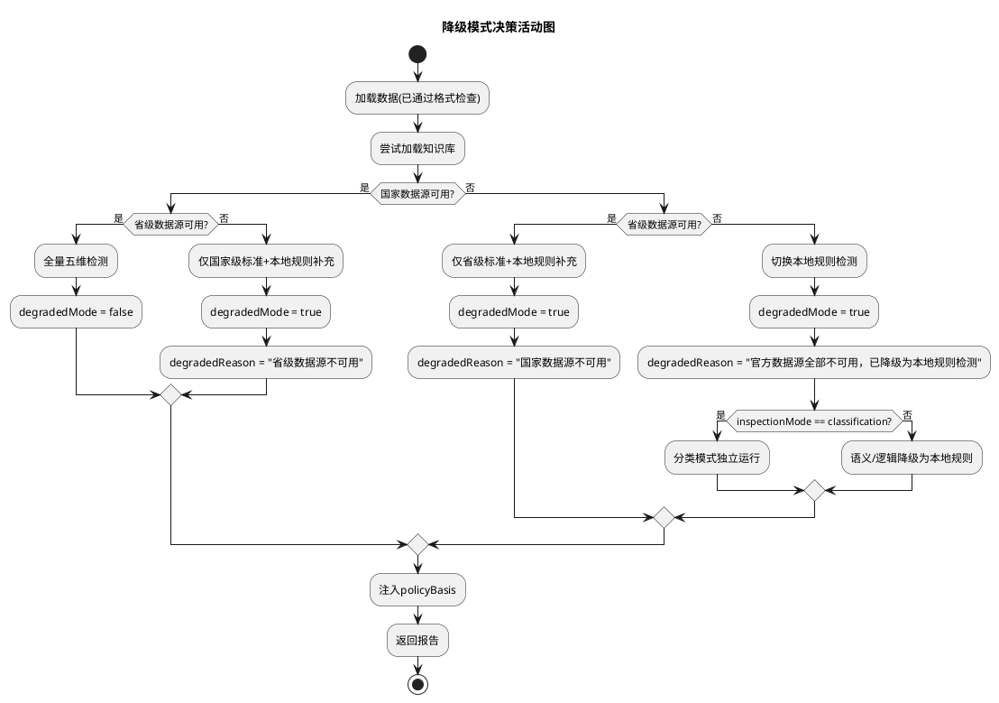
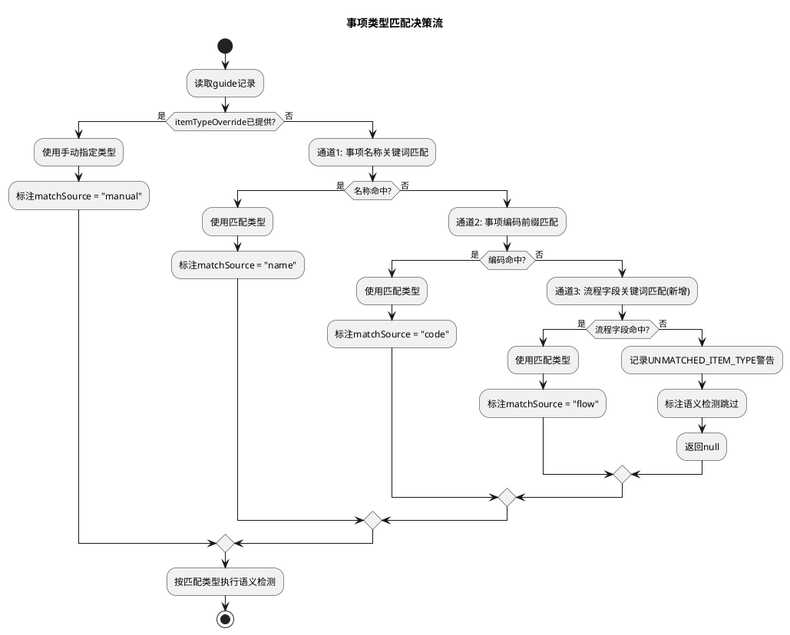
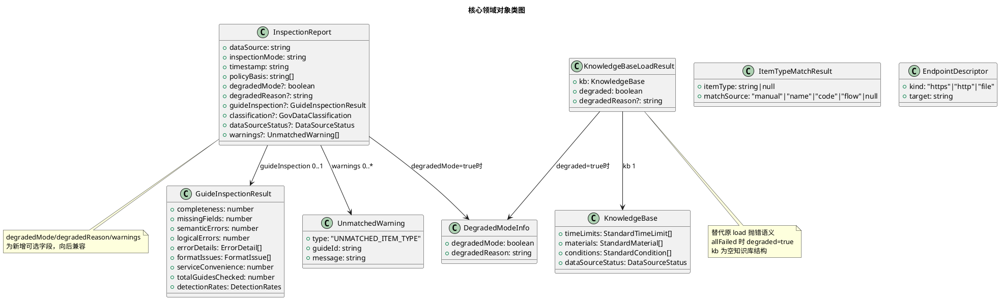

# 一、需求与存量功能关系分析

## 1.1 需求功能与存量功能对比

### 1.1.1 已实现功能

| 需求功能 | 存量功能 | 代码位置 | 匹配度 |
|---------|---------|---------|--------|
| 输入参数校验（dataSource 非空、类型检查） | execute 入口处对 dataSource 进行非空与字符串类型校验，返回 GOV_DATA_INPUT_INVALID | packages/data-asset/gov-data-inspector/src/index.ts:25-27 | 100% |
| 业务规则配置加载与字段类型校验 | loadJsonConfig 加载 business-rules.json 并对 12 个必填字段逐一类型校验 | packages/data-asset/gov-data-inspector/src/index.ts:29-75 | 100% |
| 漏项检测（MissingFieldDetector） | 基于 guideRequiredElements 配置逐字段比对，生成 missing 类型 ErrorDetail | packages/data-asset/gov-data-inspector/src/missingFieldDetector.ts | 100% |
| 逻辑检测（LogicRuleEngine） | 基于 StandardRule 触发字段与关键词执行逻辑规则检测 | packages/data-asset/gov-data-inspector/src/logicRuleEngine.ts | 100% |
| 格式检测（FormatValidator） | 基于 FormatRule 正则与 requiredKeywords 执行格式校验 | packages/data-asset/gov-data-inspector/src/formatValidator.ts | 100% |
| 质量指标计算（QualityMetricsCalculator） | 计算五维检测率、误报率、综合评分 | packages/data-asset/gov-data-inspector/src/qualityMetricsCalculator.ts | 100% |
| 数据资产分类（GB/T 47949） | classifyGovData 按 structured/semi-structured/unstructured 映射编码 | packages/data-asset/gov-data-inspector/src/index.ts:179-198 | 100% |
| 政策依据解析（policyBasis） | resolvePolicyBasis 解析政策条款并注入报告 | packages/data-asset/gov-data-inspector/src/policyBasis.ts | 100% |
| 知识库加载与多源合并（KnowledgeBaseLoader） | 国家/省级数据源按优先级合并，缓存时限/材料/条件 | packages/data-asset/gov-data-inspector/src/knowledgeBaseLoader.ts:69-106 | 75% |
| 事项类型匹配（matchItemType） | 按事项名称关键词与事项编码前缀匹配事项类型 | packages/data-asset/gov-data-inspector/src/semanticRuleEngine.ts:8-20 | 50% |
| 检测编排（InspectionOrchestrator） | 逐条记录执行漏项/语义/逻辑/格式检测并汇总 | packages/data-asset/gov-data-inspector/src/inspectionOrchestrator.ts:20-112 | 75% |
| 工具注册与参数声明 | apply 注册 inspect_gov_data 工具，声明 dataSource + inspectionMode 参数 | packages/data-asset/gov-data-inspector/src/index.ts:11-22 | 75% |

### 1.1.2 需要扩展的功能

| 需求功能 | 存量功能 | 差异说明 | 扩展方向 |
|---------|---------|---------|---------|
| 检查执行顺序重排 | 当前顺序为「输入校验→规则配置→知识库凭据检查→标准规则→政策依据→数据格式检查」 | 知识库凭据检查（index.ts:108-113）位于数据格式检查（index.ts:143-151）之前；坏 JSON + 无凭据时会先报 GOV_DATA_KB_MISSING 而非数据格式错误 | 将数据加载与格式检查前移至知识库凭据检查之前；重构 execute 内步骤为显式有序阶段 |
| 无凭据降级模式 | KnowledgeBaseLoader.load 在 allFailed 时直接 throw GOV_DATA_KB_MISSING（knowledgeBaseLoader.ts:94-98） | 无降级分支；index.ts:111-113 捕获后直接返回错误中止，分类模式与本地规则检测均不可用 | 新增降级路径：allFailed 时返回空知识库 + degraded 标记而非抛错；index.ts 捕获后切换本地规则检测并标注 degradedMode |
| 端点协议宽松化 | nationalDataSource.ts:21-23 与 provincialDataSource.ts:21-23 强制 `endpoint.startsWith('https://')` | 拒绝 HTTP 与本地文件路径端点，违反协议宽松规则 | 移除 https:// 前缀硬约束，改为 URL 可解析性校验；本地文件路径走 fs 读取分支 |
| 事项类型匹配扩展 | matchItemType 仅匹配事项名称关键词 + 事项编码前缀（semanticRuleEngine.ts:13-18） | 未读取流程字段；"建设工程规划核实"名称不含关键词时漏检现场勘查类 | 新增流程字段关键词匹配通道；匹配优先级：手动指定→名称关键词→编码前缀→流程字段关键词 |
| 未匹配警告记录 | semanticRuleEngine.ts:191-192 `if (!itemType) return []` 静默返回空数组 | 无 UNMATCHED_ITEM_TYPE 警告生成；报告中无跳过说明 | matchItemType 返回 null 时生成警告 ErrorDetail 或专用警告记录，汇入报告 |
| 工具参数声明扩展 | index.ts:18-19 仅声明 dataSource + inspectionMode 两参数 | 缺少 itemTypeOverride 手动指定事项类型参数 | parameters.properties 新增 itemTypeOverride 字段；execute 内读取并透传至 SemanticRuleEngine |
| 检测编排降级透传 | InspectionOrchestrator.orchestrate 固定接收完整 kb（inspectionOrchestrator.ts:21-26） | 无 degradedMode 入参；SemanticRuleEngine.detect 在 kb 不可用时抛错（semanticRuleEngine.ts:188-190） | orchestrate 新增 degraded 标志与降级 kb 处理；SemanticRuleEngine 在降级时跳过远端比对改为本地规则检测 |
| package.json 补丁配置 | 24 个包 dsh.bundle.patch 均为布尔值 true | DSH 插件管理器期望文件路径字符串；当前无 cordis.patch.yml 文件 | 全部 24 个包改为 "./cordis.patch.yml" 字符串；各包根目录新建 cordis.patch.yml |

### 1.1.3 需要新增的功能或接口

**打包配置模块**
- **cordis.patch.yml 文件**：24 个 @liuhange/dsh-* 包根目录各新建一份 Cordis 框架补丁声明文件，内容符合 DSH 插件配置层规范。输入：无；输出：合法 YAML 补丁声明。依赖：DSH 插件管理器解析。

**降级模式模块**
- **降级检测结果构造器**：无凭据时构造降级巡检报告，注入 degradedMode: true 与 degradedReason。输入：原始数据、本地规则配置、降级原因；输出：标注降级的 InspectionReport。依赖：InspectionOrchestrator、classifyGovData。
- **本地规则语义检测**：降级模式下基于配置内 itemTypeMatching 与 formatRules 执行本地规则检测，替代远端知识库比对。输入：guide 记录、本地配置；输出：ErrorDetail[]。依赖：SemanticRuleEngine 扩展。
- **端点协议解析器**：统一处理 HTTPS/HTTP/本地文件路径三类端点。输入：endpoint 字符串；输出：{ kind: 'url' | 'file', target: string }。依赖：NationalDataSource、ProvincialDataSource。

**事项类型匹配模块**
- **流程字段关键词匹配**：读取办事指南流程相关字段（如"办理流程""工作流程"），对其文本执行关键词匹配。输入：guide 记录、itemTypeMatching 配置；输出：itemType | null。依赖：matchItemType 扩展。
- **手动事项类型覆盖入口**：通过 itemTypeOverride 参数接收用户指定类型，优先于自动匹配。输入：itemTypeOverride 字符串；输出：itemType。依赖：index.ts 参数声明、SemanticRuleEngine。
- **未匹配警告构造器**：matchItemType 全通道未命中时生成 UNMATCHED_ITEM_TYPE 警告记录。输入：guideId；输出：警告记录对象。依赖：InspectionOrchestrator 汇总。

**异常输入处理模块**
- **超长数据规模校验器**：数据加载后校验字段总数是否超 100 万上限。输入：data 数组；输出：{ exceeded: boolean, fieldCount: number }。依赖：index.ts 数据加载后。
- **非 UTF-8 编码识别器**：文件读取阶段检测编码并优雅处理或拒绝。输入：文件路径；输出：{ content: string | null, encodingError?: string }。依赖：index.ts 文件读取。
- **无效 URL 数据源处理器**：dataSource 为 URL 时校验可达性，不可达返回友好提示。输入：dataSource 字符串；输出：{ reachable: boolean, error?: string }。依赖：index.ts 输入校验扩展。

**测试模块**
- **异常输入测试套件**：新增 6 个异常场景测试用例（坏 JSON、空数据、超长数据、无效 URL、部分字段缺失、非 UTF-8 编码）。输入：构造的异常测试数据；输出：断言友好错误码与无崩溃。依赖：vitest、现有测试框架。

## 1.2 存量功能详细分析

### 1.2.1 检查执行流程（index.ts execute）

**接口契约**：入参为 args Record<string, unknown>，出参为 JSON 字符串。异常通过 try-catch 兜底返回 UNKNOWN_ERROR。

**业务规则**：执行步骤依次为——① dataSource 非空校验；② business-rules.json 加载与 12 字段类型校验；③ 环境变量凭据读取；④ KnowledgeBaseLoader.load 知识库加载；⑤ StandardRuleSource.fetch 标准规则加载；⑥ resolvePolicyBasis 政策依据解析；⑦ readFileSync + JSON.parse 数据加载；⑧ 按 inspectionMode 分支执行检测/分类。

**约束**：步骤④（凭据检查）在步骤⑦（数据格式检查）之前执行，导致坏 JSON + 无凭据时返回 GOV_DATA_KB_MISSING 而非数据格式错误。步骤④失败即中止，无降级分支。步骤⑦使用 readFileSync 同步读取，未处理非 UTF-8 编码与超长数据。

**扩展点**：execute 为单一函数，无阶段化抽象，步骤顺序硬编码于函数体内，重排需调整代码顺序并引入显式阶段标识。

### 1.2.2 知识库加载（KnowledgeBaseLoader）

**接口契约**：load 入参为 credentials 与 dataSourcePriority，出参为 KnowledgeBase 或抛出 GOV_DATA_KB_MISSING 异常。内部维护 cachedTimeLimits/cachedMaterials/cachedConditions/cachedDataSourceStatus 四个模块级缓存。

**业务规则**：并行调用 NationalDataSource.fetch 与 ProvincialDataSource.fetch，按 priority 合并结果。allFailed（两者均 failed）时抛错中止。

**约束**：allFailed 判定后直接 throw，无降级返回路径。缓存为模块级可变变量，_setTestData 用于测试注入。getDataSourceStatus 在缓存未初始化时返回全 failed 默认值。

**扩展点**：load 返回类型固定为 KnowledgeBase，无 degraded 标记字段。需新增降级返回路径，返回空知识库 + degraded 标志而非抛错。

### 1.2.3 事项类型匹配（matchItemType）

**接口契约**：入参为 guide 记录与 itemTypeMatching 配置，出参为 itemType 字符串或 null。

**业务规则**：遍历 itemTypeMatching 各条目，若事项名称（guide['事项名称']）包含任一 keyword 则命中；若事项编码（guide['事项编码']）以 codePrefix 开头则命中。两通道均未命中返回 null。

**约束**：仅读取"事项名称"与"事项编码"两字段，未读取任何流程字段。匹配为短路返回，首个命中即返回。调用方（SemanticRuleEngine.detect:191-192）对 null 返回空数组，无警告生成。

**扩展点**：matchItemType 已导出（semanticRuleEngine.ts:200），可独立扩展。需新增流程字段匹配通道与手动覆盖入口，并在 null 返回时触发警告构造。

### 1.2.4 数据源端点协议（NationalDataSource / ProvincialDataSource）

**接口契约**：fetch 入参为 credentials（apiKey + endpoint），出参为 DataSourceFetchResult（data + status）。无凭据或端点非法时返回 FAILED_RESULT。

**业务规则**：apiKey/endpoint 缺失即返回 failed；endpoint 不以 `https://` 开头即返回 failed；fetch 请求 10 秒超时；响应非 2xx 或非数组即返回 failed。

**约束**：`endpoint.startsWith('https://')` 为硬约束（nationalDataSource.ts:21、provincialDataSource.ts:21），拒绝 HTTP 与本地文件路径。此约束违反协议宽松规则。

**扩展点**：fetch 为独立模块函数，可移除 https 前缀校验并引入端点类型分发（URL 走 fetch、本地路径走 fs）。

### 1.2.5 打包配置（24 个 package.json）

**接口契约**：dsh.bundle.patch 字段被 DSH 插件管理器在安装阶段读取，期望值为补丁文件路径字符串。

**业务规则**：当前 24 个 @liuhange/dsh-* 包的 dsh.bundle.patch 均为布尔值 true，且无任何 cordis.patch.yml 文件存在。

**约束**：DSH 插件配置层规范要求该字段为文件路径字符串，布尔值导致管理器无法定位补丁文件。修复须覆盖全部 24 个包，不可仅修 gov-data-inspector 单包。

**扩展点**：package.json 为静态配置文件，修复为字段值替换 + 新建补丁文件，无代码逻辑扩展。
# 二、增量设计方案

## 2.1 实现模型

### 2.1.1 上下文视图



### 2.1.2 服务/组件总体架构



**模块划分与职责**：
- **工具入口层**：参数声明、输入校验、数据加载与格式检查、端点协议解析。检查顺序在此层显式编排。
- **检查编排层**：逐条记录执行五维检测并汇总，接收降级标志透传至各子引擎。
- **知识库与数据源层**：多源数据加载与合并，新增降级模式控制器在 allFailed 时切换本地规则。
- **事项类型匹配层**：多通道匹配（名称→编码→流程字段→手动覆盖），未匹配时生成警告。
- **异常处理层**：编码识别、超长数据校验、URL 可达性检查，异常输入友好拦截。

**配置项及取值策略**：
- `dsh.bundle.patch`：由 `true` 改为 `"./cordis.patch.yml"` 字符串路径，24 个包统一。
- `itemTypeOverride`：新增工具参数，选填字符串，手动指定事项类型。
- 降级判定阈值：国家与省级数据源均 failed 即进入降级模式。
- 超长数据上限：100 万字段，来源于 DFX 约束 4.1.3，从配置读取而非硬编码。

### 2.1.3 实现设计文档

**检查执行顺序状态流转**：



**降级模式分支设计**：



**事项类型匹配多通道设计**：



## 2.2 接口设计

### 2.2.1 总体设计

| 接口分类 | 接口名称 | 所属模块 | 稳定性等级 | 变更类型 |
|---------|---------|---------|-----------|---------|
| 工具入口 | inspect_gov_data | index.ts | 稳定 | 扩展参数 |
| 检查编排 | InspectionOrchestrator.orchestrate | inspectionOrchestrator.ts | 稳定 | 扩展入参 |
| 知识库加载 | KnowledgeBaseLoader.load | knowledgeBaseLoader.ts | 稳定 | 扩展返回 |
| 语义检测 | SemanticRuleEngine.detect | semanticRuleEngine.ts | 稳定 | 扩展入参 |
| 事项匹配 | SemanticRuleEngine.matchItemType | semanticRuleEngine.ts | 稳定 | 扩展逻辑 |
| 数据源获取 | NationalDataSource.fetch | nationalDataSource.ts | 稳定 | 移除约束 |
| 数据源获取 | ProvincialDataSource.fetch | provincialDataSource.ts | 稳定 | 移除约束 |
| 端点解析 | EndpointResolver.resolve | 新增 | 实验 | 新增 |
| 降级控制 | DegradedModeController.activate | 新增 | 实验 | 新增 |
| 未匹配警告 | UnmatchedWarningBuilder.build | 新增 | 实验 | 新增 |
| 编码识别 | EncodingDetector.detect | 新增 | 实验 | 新增 |
| 超长校验 | DataScaleGuard.check | 新增 | 实验 | 新增 |

**接口变更策略**：所有存量接口采用向后兼容的参数扩展（新增可选参数），不破坏现有调用方。新增接口标记为实验稳定性，待验证后升级为稳定。

### 2.2.2 接口清单

#### inspect_gov_data 工具接口

**接口签名**：
```typescript
execute(args: {
  dataSource: string
  inspectionMode?: 'guide' | 'classification' | 'full'
  itemTypeOverride?: string  // 新增：手动指定事项类型
}): string  // JSON 格式巡检报告
```

**业务说明**：政务数据专项巡检入口，按「输入校验→数据格式检查→知识库凭据检查→检测执行」有序执行，支持无凭据降级与手动事项类型指定。

**前置条件**：dataSource 为非空字符串，可为本地文件路径或 HTTP/HTTPS URL。

**后置条件**：返回 JSON 报告，包含 dataSource、inspectionMode、timestamp、policyBasis（非空）；降级时含 degradedMode: true 与 degradedReason；未匹配事项含 UNMATCHED_ITEM_TYPE 警告。

**异常映射**：
- 坏 JSON → GOV_DATA_INPUT_INVALID + "JSON 格式错误，请检查文件内容"
- 空数据 → GOV_DATA_INPUT_INVALID + "无数据，请确认输入文件内容"
- 超长数据 → GOV_DATA_INPUT_INVALID + "数据量超出处理上限"
- 无效 URL → GOV_DATA_INPUT_INVALID + "数据源不可达，请检查路径或 URL"
- 非 UTF-8 → GOV_DATA_INPUT_INVALID + "文件编码非 UTF-8"
- 无凭据 → 不报错，降级模式返回结果

#### InspectionOrchestrator.orchestrate

**接口签名**：
```typescript
orchestrate(
  data: unknown[],
  config: OrchestrateConfig,
  kb: KnowledgeBase,
  standardRules: StandardRule[],
  options?: {  // 新增
    degradedMode?: boolean
    itemTypeOverride?: string
    warnings?: UnmatchedWarning[]
  }
): GuideInspectionResult
```

**业务说明**：逐条记录执行五维检测，透传降级标志与手动事项类型，收集未匹配警告。

**前置条件**：data 已通过格式检查；config 字段完整。

**后置条件**：返回 GuideInspectionResult，降级时语义/逻辑检测基于本地规则；未匹配记录的警告汇入 options.warnings。

#### KnowledgeBaseLoader.load

**接口签名**：
```typescript
load(
  credentials?: { national?: Credential; provincial?: Credential },
  dataSourcePriority?: string[],
): Promise<{  // 扩展返回
  kb: KnowledgeBase
  degraded: boolean
  degradedReason?: string
}>
```

**业务说明**：加载国家/省级数据源并按优先级合并。allFailed 时不抛错，返回空知识库 + degraded 标记。

**前置条件**：credentials 从环境变量读取。

**后置条件**：凭据可用时 degraded = false；凭据缺失/不可达时 degraded = true 并附降级原因，kb 为空知识库结构。

**异常映射**：不再抛出 GOV_DATA_KB_MISSING，改为降级返回。

#### SemanticRuleEngine.detect

**接口签名**：
```typescript
detect(
  guide: Record<string, unknown>,
  guideId: string,
  kb: KnowledgeBase,
  itemTypeMatching: ItemTypeMatchingConfig | undefined,
  severityMapping?: Record<string, string>,
  options?: {  // 新增
    degradedMode?: boolean
    itemTypeOverride?: string
  }
): { details: ErrorDetail[]; unmatched: boolean }
```

**业务说明**：执行事项类型匹配与语义检测。降级时基于本地规则检测；itemTypeOverride 优先于自动匹配；未匹配时 unmatched = true。

**前置条件**：guide 为非空对象。

**后置条件**：返回语义错误详情与未匹配标志；降级时 details 基于本地规则；kb 不可用且未降级时不抛错而返回空详情。

#### matchItemType（扩展）

**接口签名**：
```typescript
matchItemType(
  guide: Record<string, unknown>,
  itemTypeMatching: ItemTypeMatchingConfig | undefined,
  options?: { itemTypeOverride?: string }  // 新增
): { itemType: string | null; matchSource: 'manual' | 'name' | 'code' | 'flow' | null }
```

**业务说明**：多通道事项类型匹配。优先级：手动指定→名称关键词→编码前缀→流程字段关键词。

**前置条件**：itemTypeMatching 配置含 keywords 与 codePrefix 字段。

**后置条件**：返回匹配类型与匹配来源；全通道未命中返回 { itemType: null, matchSource: null }。

#### NationalDataSource.fetch / ProvincialDataSource.fetch（扩展）

**接口签名**：
```typescript
fetch(credentials?: { apiKey?: string; endpoint?: string }): Promise<DataSourceFetchResult>
```

**业务说明**：获取官方标准数据。移除 `https://` 前缀硬约束，允许 HTTP 与本地文件路径端点。

**前置条件**：endpoint 为可解析的 URL 或合法本地文件路径。

**后置条件**：端点为 URL 时走 fetch 请求；端点为本地路径时走 fs 读取；无凭据或不可达返回 FAILED_RESULT。

#### EndpointResolver.resolve（新增）

**接口签名**：
```typescript
resolve(endpoint: string): { kind: 'https' | 'http' | 'file'; target: string } | null
```

**业务说明**：解析端点字符串类型，区分 HTTPS/HTTP/本地文件路径。

**前置条件**：endpoint 为非空字符串。

**后置条件**：可解析返回类型与目标；不可解析返回 null。

#### DegradedModeController.activate（新增）

**接口签名**：
```typescript
activate(reason: string): { degradedMode: true; degradedReason: string; localKb: KnowledgeBase }
```

**业务说明**：激活降级模式，构造空知识库与降级标记。

**前置条件**：知识库加载 allFailed。

**后置条件**：返回降级标记与空知识库结构，分类模式可独立运行。

#### UnmatchedWarningBuilder.build（新增）

**接口签名**：
```typescript
build(guideId: string): UnmatchedWarning
// UnmatchedWarning = { type: 'UNMATCHED_ITEM_TYPE'; guideId: string; message: string }
```

**业务说明**：构造未匹配事项类型警告记录。

**前置条件**：matchItemType 全通道返回 null。

**后置条件**：返回固定类型 UNMATCHED_ITEM_TYPE 的警告记录。

## 2.3 数据模型

### 2.3.1 设计目标

**需支持的业务场景**：
- 无凭据降级模式下的分类独立运行与本地规则检测
- 事项类型多通道匹配与手动覆盖
- 异常输入友好拦截与错误码映射
- 24 个包的补丁配置修复与版本递增发布

**性能、容量、扩展性目标**：
- 1000 条以内响应 ≤ 5 秒；降级分类模式 ≤ 2 秒；超 100 万字段 3 秒内返回限制提示
- 降级模式不回退检测能力下限（分类 100%、本地规则覆盖基础语义/逻辑）

**与存量数据兼容策略**：
- InspectionReport 新增 degradedMode/degradedReason 为可选字段，有凭据用户输出格式不变
- OrchestrateConfig 不变，降级标志通过 options 透传
- itemTypeMatching 配置结构不变，流程字段匹配复用 keywords 字段

### 2.3.2 模型实现



**对象创建与销毁策略**：
- KnowledgeBaseLoadResult 为 load 新返回类型，替代原直接返回 KnowledgeBase + 抛错模式
- DegradedModeInfo 在降级时由 DegradedModeController.activate 构造，正常模式下不创建
- UnmatchedWarning 由 UnmatchedWarningBuilder.build 按需构造，汇入 InspectionReport.warnings 数组
- ItemTypeMatchResult 为 matchItemType 新返回类型，替代原 string | null

**持久化策略**：
- KnowledgeBaseLoader 模块级缓存（cachedTimeLimits 等）保持不变，降级时缓存空知识库结构
- 24 个 cordis.patch.yml 为静态文件持久化于各包根目录
- package.json 版本号 bump patch 后发布至 npm 注册表

**类型安全约束**：
- 所有新增字段标注为可选（`?`），符合 exactOptionalPropertyTypes: true
- matchSource 联合类型穷举匹配通道，禁用 any
- UnmatchedWarning.type 为字面量类型 `"UNMATCHED_ITEM_TYPE"`，确保类型级常量约束
- ItemTypeMatchResult.matchSource 排除 undefined，未匹配时为 null（符合 strict + noUncheckedIndexedAccess）