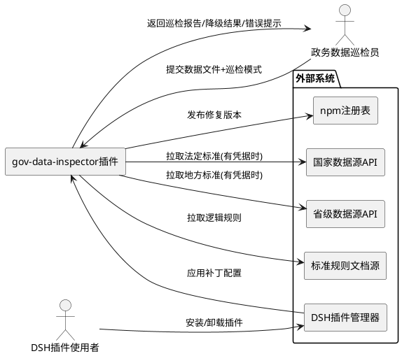
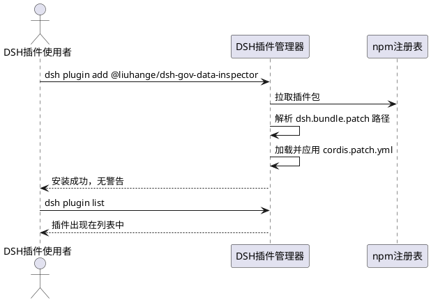
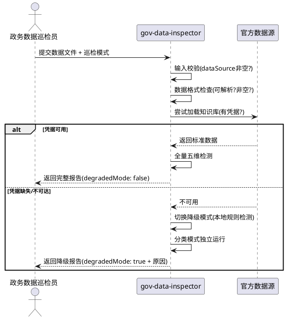
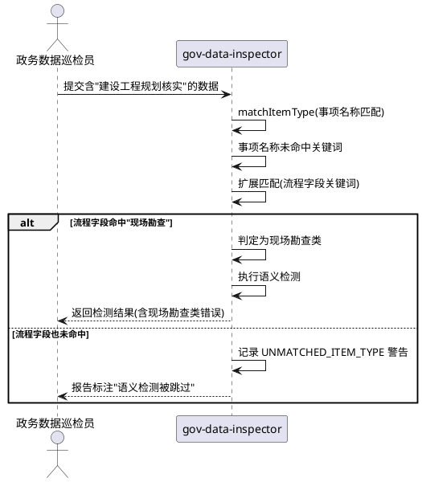
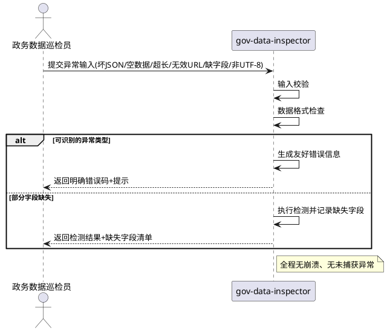
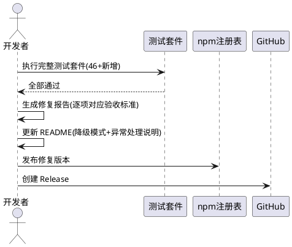

# **1. 组件定位**

## **1.1 核心职责**
本组件负责修复 @liuhange/dsh-gov-data-inspector 政务数据巡检插件的交付缺陷并增强异常健壮性，实现插件可正常安装、无凭据可用、语义检测无盲区的交付就绪状态。

## **1.2 核心输入**
1. 用户通过 DSH 插件管理器发起的插件安装指令（`dsh plugin add`）
2. 用户通过 `inspect_gov_data` 工具提交的政务数据文件路径及巡检模式参数
3. 外部配置文件 business-rules.json 中的业务规则与数据源凭据配置
4. 环境变量提供的官方数据源 API 密钥与端点地址

## **1.3 核心输出**
1. 返回给调用方的政务数据巡检报告（含漏项/语义/逻辑/格式五维检测结果与政策依据）
2. 返回给调用方的数据资产分类结果（GB/T 47949 编码）
3. 异常场景下返回的友好错误码与提示信息
4. 降级模式下返回的标注 degradedMode 的检测结果
5. 发布到 npm 的修复版本插件包

## **1.4 职责边界**
1. 本组件不负责修改任何 UI 界面与现有新版前端代码
2. 本组件不负责修改非 gov-data-inspector 插件的核心检测逻辑（仅修复其打包配置）
3. 本组件不负责重新设计检测引擎算法，仅修复检查顺序与匹配盲区
4. 本组件不负责官方数据源（国家/省级）的数据内容维护
5. 本组件不负责生成 design.md 或 tasks.md 文档

# **2. 领域术语**

**DSH 插件套件**
: 基于 DeepSeek Harness 框架开发的插件集合，使用 pnpm workspace 管理多个 @liuhange/dsh-* scoped 包。

**cordis.patch.yml**
: DSH 插件配置层规范要求的 Cordis 框架补丁文件，用于声明插件对框架运行时的补丁内容。
: 备注：package.json 中 dsh.bundle.patch 字段必须指向该文件路径，不可使用布尔值。

**无凭据降级模式**
: 当官方数据源 API 凭据缺失或全部不可达时，插件自动切换为基于本地规则检测的运行模式，并在结果中标注 degradedMode。
: 备注：降级模式下分类模式可独立运行，语义/逻辑检测精度下降但不可完全不可用。

**事项类型匹配（matchItemType）**
: 根据政务办事指南的名称、编码或流程字段关键词，判定其所属事项类型（如现场勘查类、审批类）的过程。
: 备注：匹配结果决定该条记录适用哪套语义检测规则。

**静默跳过**
: 检测引擎在事项类型匹配失败时不报错、不提示、直接返回空结果的缺陷行为。

**五维检测**
: 政务办事指南质量检查的五个维度：漏项检测、语义检测、逻辑检测、格式检测、服务便利度计算。

**policyBasis（政策依据）**
: 每份检测报告必须包含的字段，标注检测结果所依据的政策法规条款。

**EARS 格式**
: 需求验收条件采用"触发场景 → 预期行为"的表述格式。

# **3. 角色与边界**

## **3.1 核心角色**
- **DSH 插件使用者**：通过 DSH 命令行安装并调用 gov-data-inspector 插件进行政务数据巡检的运维人员或数据治理人员。
- **政务数据巡检员**：提交政务数据文件、指定巡检模式、查阅巡检报告的业务人员。

## **3.2 外部系统**
- **DSH 插件管理器**：负责解析 package.json 中 dsh.bundle.patch 配置并执行插件安装与补丁应用。
- **npm 注册表**：接收修复版本插件包的发布。
- **国家公共数据源 API**：提供法定办理时限、标准材料清单等官方标准数据。
- **省级公共数据源 API**：提供地方性政务标准数据，与国家级数据按优先级合并。
- **标准规则文档源**：提供逻辑错误检测所需的标准规则集。

## **3.3 交互上下文**

# **4. DFX约束**

## **4.1 性能**
1. **响应时间**：单次巡检（含数据加载+五维检测+报告生成）在 1000 条办事指南以内时，响应时间不得超过 5 秒。
2. **降级模式响应**：无凭据降级模式下，分类模式独立运行响应时间不得超过 2 秒。
3. **超长数据处理**：当输入数据字段总数超过 100 万时，必须在 3 秒内返回明确的限制提示，禁止长时间阻塞。

## **4.2 可靠性**
1. **可用性目标**：插件安装成功率必须达到 100%，安装过程零警告。
2. **降级可用性**：无凭据时插件不得完全不可用，分类模式与本地规则检测必须可独立运行。
3. **异常隔离**：任何异常输入（坏 JSON、空数据、坏文件、无效 URL、非 UTF-8 编码）不得导致插件崩溃或抛出未捕获异常。
4. **检测能力不回退**：有凭据时，修复后的检测能力不得低于修复前水平（语义 92.3%、逻辑 100%、漏项 100%、格式 100%、误报 0%）。

## **4.3 安全性**
1. **凭据安全**：API 密钥必须从环境变量读取，禁止硬编码于配置文件或源码中。
2. **端点协议**：允许 HTTPS 与 HTTP 端点及本地文件路径，不得强制要求 HTTPS。
3. **审计要求**：所有检测报告必须包含 policyBasis 字段以提供政策可追溯性。

## **4.4 可维护性**
1. **零硬编码**：所有业务判定规则必须从外部配置文件或官方数据源读取，禁止在源码中硬编码业务阈值或关键词。
2. **日志规范**：事项类型未匹配时必须记录 UNMATCHED_ITEM_TYPE 警告日志。
3. **测试覆盖**：修复后测试套件必须包含原有 46 个测试加新增异常输入测试，全部通过。

## **4.5 兼容性**
1. **配置兼容**：dsh.bundle.patch 配置变更后，已安装旧版本用户升级不得丢失已有配置。
2. **降级兼容**：无凭据降级模式的引入不得影响有凭据用户的现有行为与输出格式。
3. **版本发布**：所有涉及修复的包必须 bump patch 版本号后重新发布到 npm。

# **5. 核心能力**

## **5.1 插件打包配置修复**

### **5.1.1 业务规则**
1. **补丁路径配置规则**：所有 @liuhange/dsh-* 插件包的 package.json 中 dsh.bundle.patch 字段必须指向真实存在的补丁文件路径，禁止使用布尔值 true。
a. 验收条件：[检查任意 @liuhange/dsh-* 包的 package.json] → [dsh.bundle.patch 值为形如 "./cordis.patch.yml" 的字符串路径，而非布尔值 true]
2. **补丁文件存在性规则**：每个插件包根目录必须存在 dsh.bundle.patch 所指向的补丁文件，且文件内容符合 DSH 插件配置层规范。
a. 验收条件：[dsh.bundle.patch 指向 ./cordis.patch.yml] → [该包根目录下存在 cordis.patch.yml 文件且内容合法]
3. **安装零警告规则**：插件通过 DSH 插件管理器安装时不得产生任何配置相关警告。
a. 验收条件：[执行 dsh plugin --profile web add @liuhange/dsh-gov-data-inspector] → [安装成功、无警告、插件出现在插件列表中]
4. **版本递增规则**：所有涉及配置修复的包必须递增 patch 版本号后发布到 npm。
a. 验收条件：[修复完成后发布包] → [npm 上该包版本号的 patch 段较修复前递增 1]
5. **禁止项**：禁止仅修复 gov-data-inspector 单个包而遗漏其他 23 个 @liuhange/dsh-* 包的同类配置问题。
a. 验收条件：[修复完成后遍历全部 24 个包] → [所有包的 dsh.bundle.patch 均为合法文件路径]

### **5.1.2 交互流程**

### **5.1.3 异常场景**
1. **补丁文件缺失**
a. 触发条件：dsh.bundle.patch 指向的文件在包中不存在
b. 系统行为：安装阶段即报错，阻止安装
c. 用户感知：明确的"补丁文件缺失"错误提示
2. **补丁文件格式非法**
a. 触发条件：cordis.patch.yml 内容不符合 DSH 插件配置层规范
b. 系统行为：安装阶段校验失败并报错
c. 用户感知：明确的"补丁配置格式错误"提示

## **5.2 检查执行顺序与无凭据降级**

### **5.2.1 业务规则**
1. **检查顺序规则**：巡检执行必须按"输入校验 → 数据格式检查 → 知识库凭据检查 → 检测执行"的顺序进行，知识库凭据检查不得置于输入校验与数据格式检查之前。
a. 验收条件：[提交坏 JSON 或空数据且无凭据] → [返回数据格式相关错误，而非 GOV_DATA_KB_MISSING]
2. **无凭据降级启用规则**：当官方数据源凭据缺失或全部不可达时，插件必须进入降级模式而非直接中止，并在返回结果中标注 "degradedMode: true" 及降级原因。
a. 验收条件：[未配置任何 API 凭据并调用 inspect_gov_data] → [返回结果包含 degradedMode: true 字段及降级原因说明]
3. **降级模式分类独立性规则**：无凭据降级模式下，分类模式（classification）必须能够独立运行并输出分类结果。
a. 验收条件：[无凭据且 inspectionMode=classification] → [返回有效的数据资产分类结果]
4. **降级模式检测降级规则**：无凭据降级模式下，语义检测与逻辑检测应降级为基于本地规则的检测，不得完全跳过。
a. 验收条件：[无凭据且 inspectionMode=guide 或 full] → [语义/逻辑检测基于本地规则执行，结果中标注降级]
5. **端点协议宽松规则**：数据源端点配置必须允许 HTTPS、HTTP 及本地文件路径，禁止强制要求 HTTPS。
a. 验收条件：[配置 HTTP 端点或本地文件路径作为数据源] → [插件正常加载该数据源，不因协议非 HTTPS 而拒绝]
6. **有凭据不降级规则**：当凭据可用时，插件不得进入降级模式，检测能力不得下降。
a. 验收条件：[配置有效凭据并调用巡检] → [结果中 degradedMode 不为 true，检测精度与修复前一致]
7. **禁止项**：禁止在无凭据时返回 GOV_DATA_KB_MISSING 错误而完全不可用。
a. 验收条件：[无凭据且输入数据合法] → [不返回 GOV_DATA_KB_MISSING，返回降级检测结果]

### **5.2.2 交互流程**

### **5.2.3 异常场景**
1. **凭据全部不可达但数据合法**
a. 触发条件：国家与省级数据源凭据均缺失或端点不可达，但输入数据文件合法
b. 系统行为：自动进入降级模式，使用本地规则执行检测
c. 用户感知：返回降级检测结果，标注 degradedMode: true 及"官方数据源不可用，已降级为本地规则检测"
2. **数据格式错误且无凭据**
a. 触发条件：输入文件为坏 JSON 且无凭据
b. 系统行为：数据格式检查阶段即拦截，不进入知识库检查
c. 用户感知：返回 GOV_DATA_INPUT_INVALID 及友好错误提示，而非 GOV_DATA_KB_MISSING
3. **空数据且无凭据**
a. 触发条件：输入文件解析后为空数组且无凭据
b. 系统行为：数据格式检查阶段拦截
c. 用户感知：返回"无数据"提示

## **5.3 事项类型匹配与语义检测盲区消除**

### **5.3.1 业务规则**
1. **未匹配警告规则**：当事项类型匹配（matchItemType）返回空时，禁止静默跳过，必须记录 UNMATCHED_ITEM_TYPE 警告并在报告中明确标注"该事项未匹配到检测规则，语义检测被跳过"。
a. 验收条件：[提交事项名称不含任何配置关键词的记录] → [报告中包含 UNMATCHED_ITEM_TYPE 警告及明确跳过说明]
2. **流程字段关键词匹配规则**：事项类型匹配除事项名称关键词外，必须增加流程字段关键词匹配，流程中包含特定关键词即视为对应事项类型。
a. 验收条件：[事项名称为"建设工程规划核实"但流程字段含"现场勘查"] → [该记录被匹配为现场勘查类，语义检测正常执行]
3. **手动指定事项类型规则**：必须提供手动指定事项类型的入口，允许用户覆盖自动匹配结果。
a. 验收条件：[用户通过参数手动指定事项类型为现场勘查类] → [该记录按现场勘查类规则执行语义检测，忽略自动匹配结果]
4. **现场勘查类检出规则**：现场勘查类事项的语义错误必须能被检出，不得因名称不含关键词而漏检。
a. 验收条件：[使用"建设工程规划核实"作为事项名称测试] → [现场勘查类语义错误被检出并报告]
5. **禁止项**：禁止在 matchItemType 返回空时不产生任何警告或提示。
a. 验收条件：[matchItemType 返回 null] → [报告中必有对应警告记录]

### **5.3.2 交互流程**

### **5.3.3 异常场景**
1. **事项名称与流程字段均未匹配**
a. 触发条件：事项名称不含任何配置关键词，流程字段也不含任何匹配关键词，且用户未手动指定类型
b. 系统行为：记录 UNMATCHED_ITEM_TYPE 警告，跳过该条语义检测
c. 用户感知：报告中该条记录明确标注"未匹配到检测规则，语义检测被跳过"
2. **手动指定类型与自动匹配冲突**
a. 触发条件：用户手动指定事项类型，但自动匹配结果为另一类型
b. 系统行为：以用户手动指定为准执行检测
c. 用户感知：报告中标注该条记录使用用户指定的事项类型

## **5.4 异常输入健壮性**

### **5.4.1 业务规则**
1. **格式错误 JSON 处理规则**：当输入文件为格式错误的 JSON 时，必须返回友好错误提示，不得崩溃。
a. 验收条件：[提交格式错误的 JSON 文件] → [返回明确的"JSON 格式错误"提示，无崩溃、无未捕获异常]
2. **空数据处理规则**：当输入数据为空（空文件、空数组、空对象）时，必须返回"无数据"提示。
a. 验收条件：[提交空数据文件] → [返回明确的"无数据"提示，无崩溃]
3. **超长数据限制规则**：当输入数据字段总数超过 100 万时，必须返回明确的限制提示或正常处理完成，不得内存溢出。
a. 验收条件：[提交超 100 万字段的数据] → [返回明确限制提示或正常处理结果，无内存溢出、无崩溃]
4. **无效 URL 处理规则**：当数据源为无效 URL 时，必须返回不可达提示，不得崩溃。
a. 验收条件：[提交无效 URL 作为 dataSource] → [返回"数据源不可达"提示，无崩溃、无未捕获异常]
5. **部分字段缺失处理规则**：当输入数据部分字段缺失时，必须报告缺失字段清单。
a. 验收条件：[提交部分必填字段缺失的数据] → [报告中列出缺失字段清单]
6. **非 UTF-8 编码处理规则**：当输入文件为非 UTF-8 编码时，必须优雅处理或明确拒绝。
a. 验收条件：[提交非 UTF-8 编码文件] → [返回明确编码错误提示或正确处理，无乱码崩溃]
7. **禁止项**：禁止任何异常输入导致插件进程崩溃或抛出未捕获异常。
a. 验收条件：[提交上述任意异常输入] → [均返回明确友好的错误信息，进程不崩溃]

### **5.4.2 交互流程**

### **5.4.3 异常场景**
1. **JSON 语法错误**
a. 触发条件：输入文件内容不是合法 JSON（如缺少引号、括号不匹配）
b. 系统行为：解析阶段捕获错误并生成友好提示
c. 用户感知：错误码 GOV_DATA_INPUT_INVALID + "JSON 格式错误，请检查文件内容"
2. **空数据输入**
a. 触发条件：文件解析结果为空数组或空对象
b. 系统行为：检测前校验数据非空
c. 用户感知：明确"无数据，请确认输入文件内容"提示
3. **超长数据输入**
a. 触发条件：数据字段总数超过 100 万
b. 系统行为：校验数据规模，超限则返回限制提示或分批处理
c. 用户感知：明确"数据量超出处理上限"提示或正常处理结果
4. **无效 URL 数据源**
a. 触发条件：dataSource 为格式错误或不可达的 URL
b. 系统行为：加载阶段捕获错误
c. 用户感知："数据源不可达，请检查路径或 URL"提示
5. **部分字段缺失**
a. 触发条件：数据记录缺少部分必填字段
b. 系统行为：漏项检测识别并记录缺失字段
c. 用户感知：报告中缺失字段清单
6. **非 UTF-8 编码文件**
a. 触发条件：文件编码为 GBK、Latin-1 等非 UTF-8 编码
b. 系统行为：读取阶段识别编码并优雅处理或明确拒绝
c. 用户感知：明确"文件编码非 UTF-8"提示或正确处理结果

## **5.5 全局交付保障**

### **5.5.1 业务规则**
1. **完整测试套件通过规则**：所有修复完成后，完整测试套件（原有 46 个测试加新增异常输入测试）必须全部通过。
a. 验收条件：[执行完整测试套件] → [所有测试通过，无失败、无跳过]
2. **修复报告输出规则**：必须输出修复报告，逐项对应修复项 1-4 的验收标准说明达成情况。
a. 验收条件：[全部修复完成] → [存在修复报告，逐项对应验收标准并标注达成状态]
3. **README 更新规则**：必须更新 README，新增"无凭据降级模式"说明和"异常输入处理"说明。
a. 验收条件：[修复完成后查阅 README] → [包含无凭据降级模式说明章节和异常输入处理说明章节]
4. **npm 发布与 GitHub Release 规则**：修复后必须重新发布到 npm 并在 GitHub 上创建 release。
a. 验收条件：[修复完成] → [npm 上存在修复版本包，GitHub 上存在对应 release]
5. **policyBasis 必备规则**：所有插件输出报告必须包含 policyBasis 字段。
a. 验收条件：[任意巡检模式输出报告] → [报告包含非空 policyBasis 字段]
6. **禁止项**：禁止修复一个缺陷时引入新的破坏（修好一个不能破坏另一个）。
a. 验收条件：[任意修复项完成后执行回归测试] → [原有通过的测试仍全部通过]

### **5.5.2 交互流程**

### **5.5.3 异常场景**
1. **回归测试失败**
a. 触发条件：某修复项引入新破坏，原有测试出现失败
b. 系统行为：阻止发布，要求修复引入的破坏
c. 用户感知：修复报告中标注该修复项引入回归，需返工

# **6. 数据约束**

## **6.1 巡检请求参数**
1. **dataSource**：必填，字符串类型，表示政务数据文件路径或 URL，允许本地文件路径、HTTP/HTTPS URL。
2. **inspectionMode**：选填，枚举值（guide、classification、full），缺省值为 full。
3. **itemTypeOverride**：选填，用户手动指定事项类型，用于覆盖自动匹配结果。

## **6.2 巡检报告**
1. **dataSource**：必填，字符串，标注本次巡检的数据源。
2. **inspectionMode**：必填，字符串，标注本次巡检模式。
3. **timestamp**：必填，ISO 8601 格式时间字符串，标注巡检时间。
4. **policyBasis**：必填，非空字符串数组，标注政策依据条款。
5. **degradedMode**：选填，布尔值，为 true 时表示处于无凭据降级模式。
6. **degradedReason**：选填，字符串，当 degradedMode 为 true 时必填，说明降级原因。
7. **guideInspection**：选填，办事指南质量检查结果对象，inspectionMode 为 guide 或 full 时存在。
8. **classification**：选填，数据资产分类结果对象，inspectionMode 为 classification 或 full 时存在。
9. **dataSourceStatus**：选填，数据源状态对象，标注各数据源的可用性。

## **6.3 事项类型匹配配置**
1. **keywords**：字符串数组，事项名称或流程字段的关键词列表，命中任一即视为该事项类型。
2. **codePrefix**：字符串，事项编码前缀，编码以此开头即视为该事项类型。

## **6.4 降级模式标识**
1. **degradedMode**：布尔值，true 表示降级模式，false 或缺省表示正常模式。
2. **degradedReason**：字符串，降级原因的完整描述，仅在 degradedMode 为 true 时有效。

## **6.5 未匹配警告记录**
1. **警告类型**：固定值 UNMATCHED_ITEM_TYPE。
2. **guideId**：字符串，未匹配事项的标识。
3. **说明**：字符串，固定含义"该事项未匹配到检测规则，语义检测被跳过"。